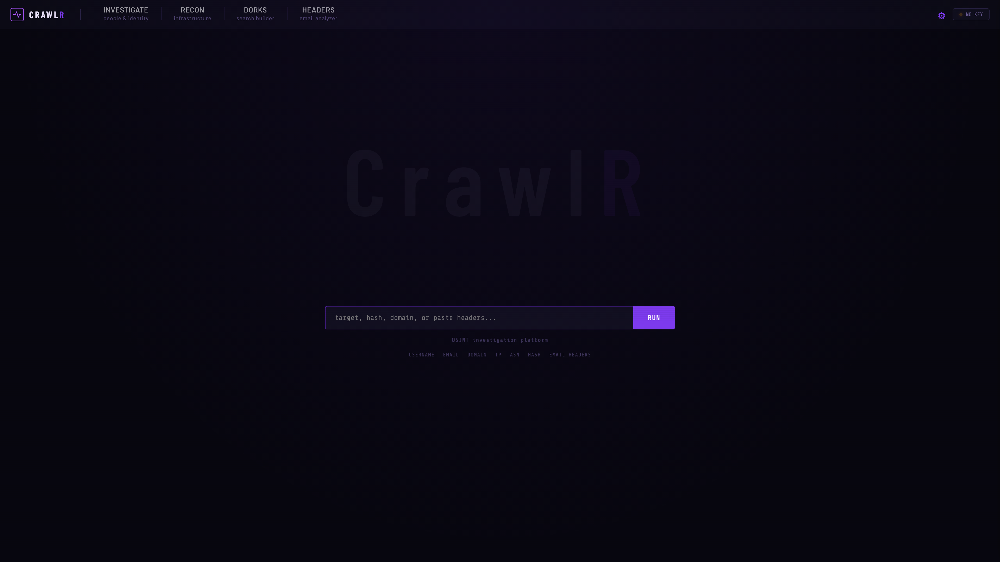
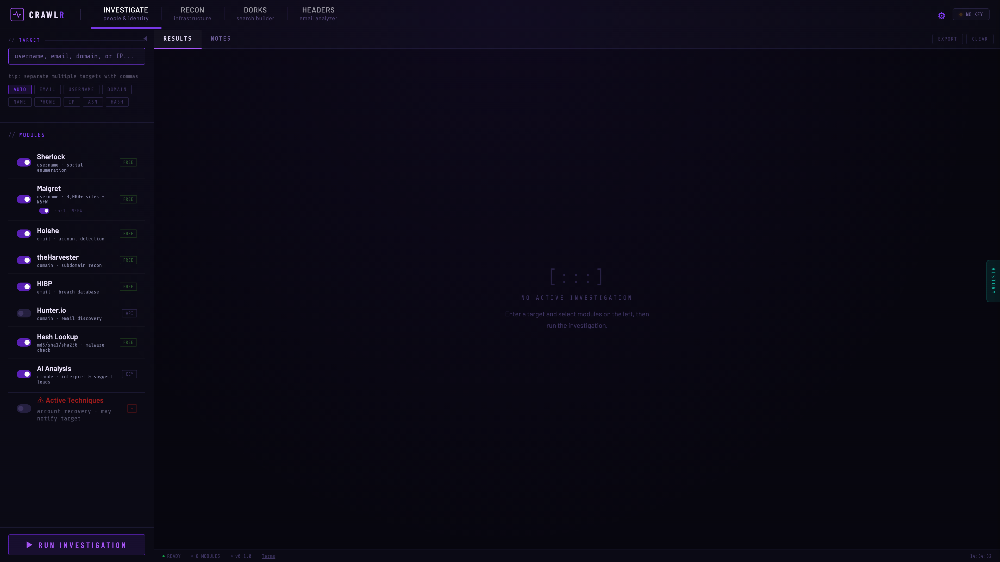
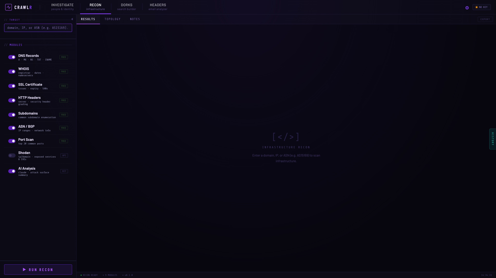
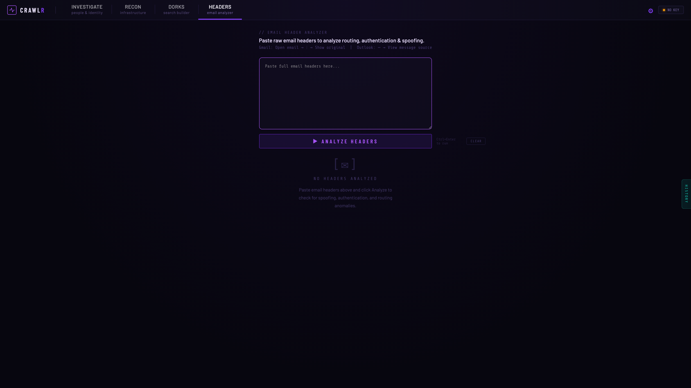
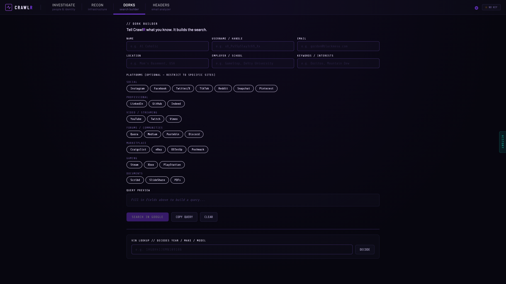

# CrawlR — OSINT Investigation Platform

   

> Open your browser and start investigating. No install. No setup. One Claude API key unlocks everything.

**[crawlr.lol](https://crawlr.lol)**

---

## What is CrawlR

CrawlR is a browser-based OSINT platform for identity investigation and infrastructure reconnaissance. Type a username, email, domain, IP, phone number, or hash — CrawlR auto-detects the target type and runs the right tools automatically. Results are consolidated in a single interface, and an optional AI-powered Deep Dive generates a full intelligence dossier from everything found.

No Python environment. No CLI. No configuration files. Open the URL and go.

---

## Screenshots

### Landing Page


### INVESTIGATE — People & Identity


### Deep Dive Intelligence Dossier


### RECON — Infrastructure


### HEADERS — Email Analyzer


### DORKS — Search Builder


---

## Use Cases

- **Security researchers** — map a target's digital footprint across hundreds of platforms
- **Penetration testers** — enumerate subdomains, open ports, exposed services, and attack surface
- **Incident responders** — analyze suspicious email headers for spoofing, phishing, and routing anomalies
- **Journalists & investigators** — correlate usernames, emails, and aliases across public sources
- **HR & background screening** — surface public platform presence for a given name or handle
- **CTF / Trace Labs** — rapid OSINT for missing persons and identity challenges
- **IT & infosec teams** — quick infrastructure lookups without spinning up separate tools

---

## Modes

### INVESTIGATE — People & Identity

Auto-detects usernames, emails, names, phone numbers, and hashes. Runs selected modules in parallel and consolidates results.

| Module | What it does | Cost |
|---|---|---|
| Sherlock | Username enumeration across 400+ social platforms | Free |
| Maigret | Username enumeration across 3,000+ sites with confidence scoring | Free |
| Holehe | Email-to-account detection via registration checks | Free |
| theHarvester | Email and subdomain discovery from public sources | Free |
| HIBP | Have I Been Pwned breach database lookup | Free |
| GitHub | Profile, repos, activity, and linked email scraping | Free |
| Profile Scraper | Bios, display names, and metadata from YouTube, Reddit, and more | Free |
| Platform Check | Email registration check across social platforms via Holehe | Free |
| Hash Lookup | MD5/SHA1/SHA256 checked against MalwareBazaar, CIRCL, AlienVault OTX, ThreatFox | Free |
| Phone Search | Carrier lookup links for TrueCaller, Spokeo, WhitePages, BeenVerified | Free |
| Hunter.io | Domain email discovery and address pattern detection | API Key |
| AI Analysis | Claude-powered interpretation with investigative leads | Claude Key |
| Deep Dive | Full intelligence dossier — see below | Claude Key |

**Deep Dive Intelligence Dossier**

Run Deep Dive after an investigation to generate a structured intelligence report:
- Quick Intel Summary: real name, location, occupation, email, OPSEC rating, key risk, platforms confirmed
- Subject Profile narrative
- Confidence Matrix with HIGH/MEDIUM/LOW evidence ratings
- Platform Correlation analysis
- OPSEC Assessment
- Ready-to-use Google search queries

---

### RECON — Infrastructure

Enter a domain, IP, or ASN to map the full infrastructure footprint.

| Module | What it does | Cost |
|---|---|---|
| DNS Records | A, MX, NS, TXT, CNAME, SOA with Cloudflare proxy detection | Free |
| WHOIS | Registrar, registration dates, nameservers, privacy detection | Free |
| SSL Certificate | Issuer, SANs, expiry, chain details | Free |
| HTTP Headers | Server identification, security header grading (A/B/C/F) | Free |
| Subdomains | DNS enumeration + certificate transparency via crt.sh | Free |
| ASN / BGP | IP-to-ASN mapping, org, prefixes, peering data | Free |
| Port Scan | Top 20 common ports (SSH, HTTP, RDP, SMB, databases, etc.) | Free |
| Shodan | Exposed services, open ports, CVEs, and host intelligence | API Key |
| AI Analysis | Claude-powered attack surface summary and red team next steps | Claude Key |

Includes a D3.js topology graph (TOPOLOGY tab) for interactive visualization of DNS records and ASN prefix maps.

---

### HEADERS — Email Analyzer

Paste raw email headers to investigate phishing, spoofing, and routing anomalies.

- SPF / DKIM / DMARC authentication status
- Routing hop analysis with delay flagging
- Sender geolocation via IP lookup
- Anomaly detection: Return-Path mismatch, Reply-To redirect, display name spoofing, brand impersonation
- Verdict badges: LEGITIMATE / SUSPICIOUS / SPOOFED / LIKELY PHISHING
- AI Analysis: Claude-powered verdict with full reasoning and next steps

How to get raw headers: Gmail — open email → ⋮ → Show original | Outlook — ⋯ → View message source

---

### DORKS — Search Builder

Build precise Google dork queries without memorizing syntax.

- Named fields: Name, Username, Email, Location, Employer, Keywords
- Platform chips by category: Social, Professional, Video, Forums, Marketplace, Gaming, Documents
- Live query preview as you type
- Search in Google or copy query to clipboard
- VIN Decoder: decode vehicle year, make, model, and trim via NHTSA API

---

## Getting Started

### Use the hosted version (recommended)

Go to **[crawlr.lol](https://crawlr.lol)** — no account, no setup required.

Add your Claude API key in Settings (gear icon, top right) to unlock AI features. Everything else works without any key.

### Self-host
```bash
git clone https://github.com/Err0ric/crawlr
cd crawlr
pip install -r requirements.txt
uvicorn main:app --reload --port 8000
```

Open `http://localhost:8000` and add your Claude API key in Settings.

---

## API Keys

All keys are stored in your browser's localStorage only and are never transmitted to CrawlR's server.

| Key | Required for | Where to get it |
|---|---|---|
| Claude API Key | AI Analysis, Deep Dive, RECON AI, HEADERS AI | console.anthropic.com |
| Hunter.io | Email discovery module | hunter.io |
| Shodan | Exposed services and CVE data | shodan.io |
| HIBP | Breach database lookup | haveibeenpwned.com/API/Key |

The core tool — Sherlock, Maigret, Holehe, theHarvester, DNS/WHOIS/SSL, Hash Lookup, Email Header Analysis — runs completely free with no keys required.

---

## Features

- **Auto-detection** — paste any target type and CrawlR routes to the right mode automatically
- **BYOK** — all API keys stored in localStorage, never sent to server
- **Bulk search** — comma-separate multiple targets, AI correlates across all results
- **History panel** — all investigations saved with one-click reload including Deep Dive results
- **Notes panel** — detachable floating notepad, persists across sessions
- **Export** — full Markdown export of any investigation
- **5 themes** — Dark Purple (default), Midnight, Blood, Ghost, Flashbang
- **Maigret confidence scoring** — confirmed/likely/unknown badges on results
- **D3.js topology graphs** — interactive DNS and ASN visualization in RECON

---

## Privacy & Security

- API keys stored in browser localStorage only, never transmitted to any server
- No user accounts, no tracking, no analytics
- Active Techniques (account recovery checks) disabled by default and warn before enabling — these may notify the target

---

## Legal

For authorized security research, penetration testing, investigative journalism, and missing persons investigations only. Users must agree to Terms of Service on first launch. Do not use CrawlR to investigate individuals without lawful authorization.

---

## Roadmap

- Reverse image search on profile pictures
- Case mode for Trace Labs CTF competitions
- Link analysis graph view via Cytoscape.js
- Phone deep search via AI-assisted site traversal

---

## Author

Eric Henderson | [github.com/Err0ric](https://github.com/Err0ric)
